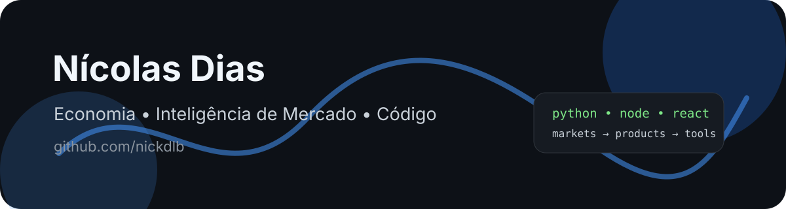

<!--
Perfil GitHub de Nícolas Dias (@nickdlb)
Como usar:
1. Crie um repositório público chamado `nickdlb`.
2. Envie este README.md para a raiz do repositório.
3. Envie também as pastas assets/ e .github/workflows/ caso queira banner e automações.
4. Substitua os links de e-mail, LinkedIn, portfólio e projetos quando quiser.
-->

  

## Sobre mim

Sou **Nícolas Dias**, economista formado pela **UFRGS** em **2025/2** e desenvolvedor com experiência prática em web desde **2019**. Trabalho na interseção entre **inteligência de mercado**, **automação**, **produtos digitais** e **desenvolvimento web**.

Atualmente atuo como **Analista de Inteligência de Mercado na Ecomet**, sou fundador da **Agência DLB** e também construo projetos como **Feedybacky**, **LicitaAi**, **LocalSEO** e outras soluções digitais.

- 🔭 Hoje trabalho principalmente com **Python**, **Node.js**, **React** e aplicações web.
- 🧠 Minha base combina **Economia**, **ciêncai de dados**, **mercado**, **machine learning** e **tecnologia**.
- 🛠️ Comecei criando sites, lojas e projetos em **HTML/CSS/JavaScript** desde 2019. Depois comecei a trabalhar com Wordpress, até conhecer drogas mais pesadas como o Python.
- 🚀 Gosto de transformar problemas que eu observo e sinto no dia a dia em ferramentas simples, úteis e escaláveis.
- 💬 Pode me perguntar sobre **Python**, **JavaScript/TypeScript**, **Node**, **React**, **SEO local**, **automações** e **inteligência de mercado**.

 

  <!-- Substitua os links abaixo quando quiser -->
  
  
  

## 🧰 Linguagens e ferramentas

  

**Foco atual:** Python, Node.js, React, JavaScript/TypeScript, automações, produtos web, dados e inteligência de mercado.

## 🚀 Projetos em destaque

| Projeto | Descrição | Stack / área |
|---|---|---|
| **Feedybacky** | Projeto voltado a feedback, produto e melhoria de experiência. | Web, produto, automação |
| **LicitaAi** | Solução relacionada a licitações, análise e inteligência aplicada a oportunidades públicas. | Python, dados, IA/automação |
| **LocalSEO** | Ferramentas e estratégias para presença local, SEO e aquisição orgânica. | SEO, web, dados |
| **Outros projetos web** | Sites, lojas e aplicações criadas desde 2019. | HTML, CSS, JS/TS, React |

> Depois, substitua os nomes acima por links diretos para os repositórios ou sites dos projetos.

## 📊 Estatísticas

  

  Economia, dados, tecnologia e vontade de construir soluções melhores.

